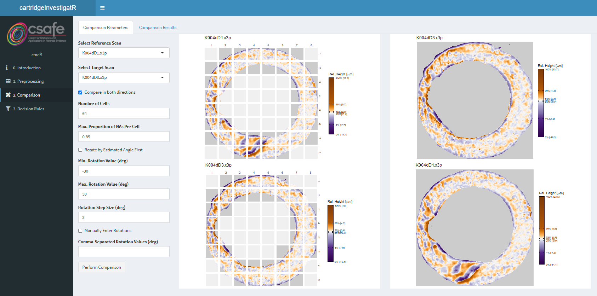

# cartridgeInvestigatR
Shiny app for processing and comparing cartridge case scans

# App usage tutorial

## 1. Preprocessing tab

### Import

Click `Select a folder containing x3p files` to select a directory of cartridge case scans to import into the app. If these scans have been preprocessed outside of the app, then you can click the `Skip Preprocessing` button and move onto the `2. Comparison` tab.

For the sake of an example, we will focus on the known-match TopMatch scans K004dD1 and K004dD3. As these scans are already preprocessed, we will skip the preprocessing procedures by clicking the `Skip Preprocessing` button.

### Initial X3P

This tab will allow you to visually inspect cartidge case scans imported into the app. The `Downsample for Plotting` input is intended to reduce the load times of generating visualizations, but will not affect the underlying cartridge case data.

By clicking the `Focus on a Single X3P` button, you manually specify the cartridge case center (via a single-click), the firing pin center (via a double-click), or remove regions of the scan (via click + drag). Click the `Reset Changes` button to reset these manual specifications.

Below is an example of the (already preprocessed) K004dD1 and K004dD3 scans.

### Preprocess

If the imported cartridge case scans require preprocessing, this tab will allow you to apply the procedures implemented in the cmcR package.

Note for future: this tab will be changed to allow the user to change the preprocessing procedures applied.

 - Allow the user to choose successive preprocessing steps by a selectInput dropdown (e.g., Downsample, Crop Exterior, Crop Interior, Level, etc.).
  - I'm thinking successive conditional panels that show up only when the user has selected an option from previous selectInput panel.
  - Include a "delete step" button in each panel
  - `Perform Preprocessing` button below the panels that the user clicks once they're happy with the preprocessing steps.
 - Allow user to upload R script of custom functions that will show up in the selectInput list.

## 2. Comparison tab

### Comparison parameters

Select the desired comparison parameters in this tab. Click the `Perform Comparison` button once the parameters are chosen.

 - `Select Reference Scan`: choose scan to be considered the "reference"
 - `Select Target Scan`: choose the scan to be consdiered the "target"
 - `Compare in both directions`: specify whether the comparison procedure is to be applied in both directions (i.e., reference compared to target and vice versa)
 - `Number of cells`: must be a perfect square.
 - `Max. Proportion of NAs per Cell`: cells that do not meet this criterion will be grayed-out (i.e., a higher alpha level) in the plots shown on the right.
 - `Rotate by Estimated Angle First`: attempts to estimate the optimal rotation between the two scans and rotates the target scan (specified by `Select Target Scan`) before performing the cell-based comparison procedure.
 - `Min. Rotation Value (deg)`, `Max. Rotation Value (deg)`, `Rotation Step Size (deg)`: The values will be used to create a grid of rotations used for the comparison. Specifically, the values will be used by the `seq` function as `seq(from = min, to = max, by = step)`.
 - `Manually Enter Rotations`: if checked, the algorithm will ignore the values entered into `Min. Rotation Value (deg)`, `Max. Rotation Value (deg)`, `Rotation Step Size (deg)` and will instead only consider those values entered into `Comma-Separated Rotation Values (deg)`
   - Note: for some reason shiny wasn't creating a conditional panel depending on whether `Manually Enter Rotations` was checked -- optimally I would like to show/hide the two rotation options (a sequence of manually-specified values) depending on whether `Manually Enter Rotations` is checked.
 - `Comma-Separated Rotation Values (deg)`: e.g., -30,0,30

### Comaprison Results

Click on a cell on the left to see the most similar regions (ordered by the pairwise-complete correlation) from the other scan. The black squares show where the cell attained its highest CCF (calculated via the Cross-Correlation Theorem) in the region. The CCF "maps" below each region indicate how the translations are estimated.

In the example below, cell (3,1) was selected from K004dD1. We can see that the cell's 3 most similar regions are associated with similar rotations (-21, -15, -18 degrees).

## 3. Decision Rules tab

### Original Method of Song (2013)

Visualize the CMCs identified by the Original Method of Song (2013). Below the CMC plots are diagnostic plots showing the distribution of the `x`, `y`, `theta`, and `CCF` (specifically, the pairwise-complete correlation) values for each cell/region pairing. These plots can help diagnose whether these values actually achieve a consensus (i.e., concentrate around a particular value). All values that fall within the purple rectangles are deemed "congruent" values. Under the original method of Song (2013), only cells that have congruent `x`, `y`, `theta`, and `CCF` values are labeled "Congruent Matching Cells."

We can see below that the comparison in which K004dD1 was partitioned into a grid of cells and compared to regions in K004dD3 yielded 8 Original Method CMCs (under the specified thresholds). The diagnostic plots indicate that the `x` and `y` values yield little consensus while rotations appear to achieve a mode around -6 degrees. For sake of space, the 10 Original Method CMCs identified when K004dD3 is partitioned into a grid of cells and compared to regions in K004dD1 are not shown.

### High CMC Method

Visualize the CMCs identified by the High CMC method. Below the CMC plots are the correspoinding CMC-`theta` distribution defined in Tong et al. (2015). This CMC-`theta` distribution is used to classify cell/region pairs as CMCs.

We can see below that the comparison in which K004dD1 was partitioned into a grid of cells and compared to regions in K004dD3 yielded 15 High CMCs (under the specified thresholds). We can see that the CMC-`theta` distribution attains a mode around -9 degrees. Additionally, the `theta` values with "High CMC" counts (defined to be at least 13 - 1 =  12 CMCs) are within the `Rotation Threshold (deg)` value specified (6 degrees). Thus, this direction "passes" the CMC criteria. For sake of space, the 13 High CMCs identified when K004dD3 is partitioned into a grid of cells and compared to regions in K004dD1 are not shown.

