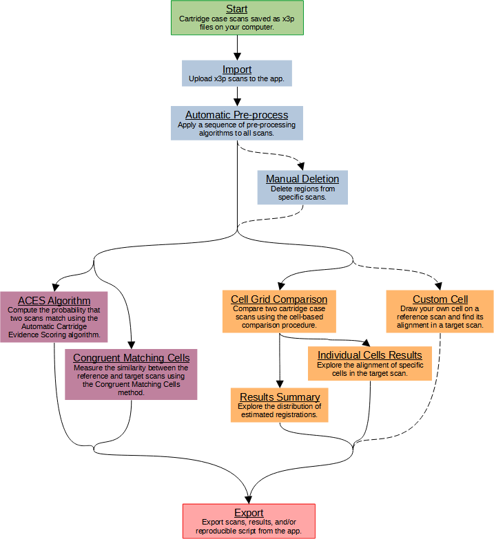

# cartridgeInvestigatR
Use this app to compare 3D topographical scans of cartridge cases.
Click the 'Help' button on each tab to learn about its functionality.
An overview of the app functionality is provided below.

# App usage tutorial

This application uses computer algorithms to process and compare scans of cartridge cases.
A *cartridge case* is the metal casing that houses the bullet and gunpowder prior to firing.
When a gun is fired, as the bullet moves down the barrel, the cartridge case moves backwards and slams against the back wall of the barrel (the *breech face* with considerable force.
Any markings on the breech face are "stamped" into the surface of the cartridge case.
This leaves so-called [*breech face impressions*](https://www.firearmsid.com/A_CCIDImpres.htm) that forensic examiners use to identify the gun from which a cartridge case was fired.
Think of these impressions as analogous to a gun's fingerprint left on the cartridge case.
The computer algorithms used in this app compare the breech face impressions on two cartridge cases.

# About this app

This app allows individuals to engage with cartridge case comparison algorithms without needing to program.
If you are interested in cartridge case identification, but do not have expertise in the R programming language, then this app is for you.
For more information about the computer algorithms used in this application, visit [https://jzemmels.github.io/research.html](https://jzemmels.github.io/research.html)
To use this app, you must have cartridge case scans stored on your computer as [x3p files](https://tsapps.nist.gov/NRBTD/Home/DataFormat).
An X3P (XML 3D Surface Profile) is an ISO standard file format for saving cartridge case scans.
You can download example cartridge case .x3p files from the [NIST Ballistics Toolmark Research Database](https://tsapps.nist.gov/NRBTD/).
The functionality of this app encompasses three stages of the cartridge case comparison procedure: Pre-processing, Exploring, and Scoring.
These stages are separated into the three tabs that you can see on the left sidebar.
You must complete the Import + Pre-processing stage before moving on to Explore or Score.

## Basic workflow

To start, make sure that you have cartridge case scans stored as x3p files on your computer.
If you would simply like to explore this app, you can find example scans in the home directory of this app.

### Import + Pre-process

Use the 'Import + Pre-process' tab to upload scans to the app.
Click the 'Select a folder containing x3p files' to upload scans.
You may need to pre-process scans to highlight the breech face impressions prior to comparison.
Note that the example scans in the home directory have already been pre-processed to some extent, but you're welcome to experiment with additional pre-processing steps.

**If your scans require pre-processing**

The 'Automatic Pre-process' tab allows you to string-together algorithms to automatically pre-process your scans.
Click the 'Add Another Pre-processing Step' to add a pre-processing algorithm to the sequence.
You can also select parameters for the selected pre-processing algorithm.
Click 'Perform Automatic Pre-processing' once you're happy with the pre-processing sequence or 'Reset All Pre-processing Steps' to start over.
A pre-processing sequence that we have found to work well for many unprocessed scans is as follows:

1. Crop with parameters Region set to 'Interior' and Offset set to a positive value (try about 10% of the dimensions of the scan).
2. Crop with parameters Region set to 'Exterior' and Offset set to a negative value (try about 30% of the dimensions of the scan).
3. Level with parameter Statistic set to 'Median' (the default).
4. Filter with paramaters Filtertype set to 'Bandpass' and Wavelength(s) set to '16, 500' (the defaults).
5. Downsample with parameter Stride set to '2' (the default).

The Erode step with the Radius parameter set to a positive value will 'shave off' the interior/exterior of scans.
The Delete step is useful if your uploaded scans include masks identifying regions that you would like to remove.
We encourage you to experiment with different pre-processing steps and orders.

Move to the 'Manual Deletion' tab to remove specific regions from scans.

**After your scans are pre-processed**

Press the 'I would like to compare these scans' button at any time to complete the Import + Pre-process phase.
Once completed, you cannot return to the Import + Pre-process phase and will need to restart the app if you decide additional pre-processing is needed.
You can next move on to the Explore or Score phases.

### Explore

In the 'Cell Grid Comparison' tab, select a reference and target scan to compare.
If you're simply exploring the app, we have chosen default parameter settings that work well.
However, we encourage experimentation if you're interested.
Click on the 'Perform Comparison' button at the bottom of the sidebar once you're happy with the parameters.
Once the comparison finishes (the loading bar vanishes), you can assess the comparison results using the 'Results Summary' or 'Individual Cell Results' tabs.
In the 'Results Summary' tab, you can select a scan from the dropdown.
The plots that appear depict the similarity features extracted during the cell-based comparison procedure.
In the 'Individual Cell Results' tab, you can select a scan from the dropdown.
Click on a cell in the plot that appears to visualize its alignment in the compared scan.
A comparison plot appears at the bottom of the page that shows similarities and differences between the selected cell and the region to which it aligns in the other scan.
Finally, the 'Custom Cell' tab allows you to draw your own cell (either rectangular or hand-drawn) on a scan and compare this it to another scan.
This tab can be used to analyze how a specific region of interest aligns in another scan.
All of these plots are interactable: clicking on one element will highlight elements in the other plots corresponding to the same cell.

### Score

Select a reference and target scan to compare.
Use the 'ACES Algorithm' tab to apply the Automatic Cartridge Evidence Scoring algorithm that computes the probability that the two scans match.
Use the 'Congruent Matching Cells' tab to apply Congruent Matching Cells algorithm.

### Export

Use this tab to export scans or results computed in the app.
You can export results as Comma-Separated Variable (.csv) or .RData files.
You can also download an R script to reproduce the comparison results.

## References

Zheng, X., Soons, J., Thompson, R., Singh, S., & Constantin, C. (2020). NIST Ballistics Toolmark Research Database. In Journal of Research of the National Institute of Standards and Technology (Vol. 125). National Institute of Standards and Technology (NIST). https://doi.org/10.6028/jres.125.004 

J. Song. Proposed “NIST Ballistics Identification System (NBIS)” Based on 3D Topography Measurements on Correlation Cells. American Firearm and Tool Mark Examiners Journal, 45(2):11, 2013. URL https://tsapps.nist.gov/publication/get_pdf.cfm?pub_id=910868.")
