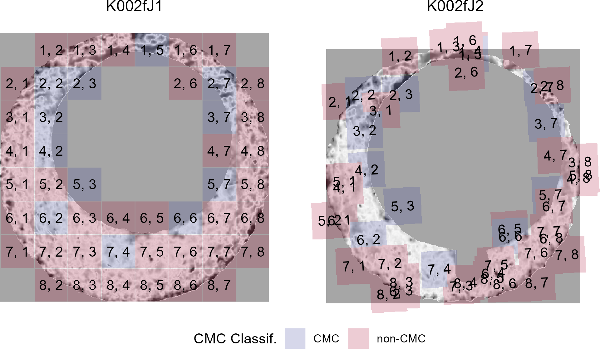

background-image: url("images/title-slide-bkgd.png")

</br>

# `cartridgeInvestigatR`

## An Interactive App for Cartridge Case Identification

### Joseph Zemmels

#### International Association for Identication Conference, 2022

```{r, load_refs, eval=FALSE,include=FALSE, cache=FALSE}
library(RefManageR)
# remotes::install_github("ROpenSci/bibtex")
RefManageR::BibOptions(check.entries = FALSE,
                       bib.style = "authoryear",
                       cite.style = "alphabetic",
                       style = "markdown",
                       max.names = 1,
                       no.print.fields = c("urldate","file","issn","url","keywords","language","abstract"),
                       hyperlink = FALSE,
                       dashed = FALSE)
myBib <- RefManageR::ReadBib("ref.bib", check = FALSE)
```

```{r setup, include=FALSE}
library(tidyverse)
library(cmcR)
library(x3ptools)
library(patchwork)

options(htmltools.dir.version = FALSE)

knitr::opts_chunk$set(echo = FALSE,
                      fig.align = 'center')
```


---

# Acknowledgements

## Funding statement

This work was partially funded by the Center for Statistics and Applications in Forensic Evidence (CSAFE) through Cooperative Agreement 70NANB20H019 between NIST and Iowa State University, which includes activities carried out at Carnegie Mellon University, Duke University, University of California Irvine, University of Virginia, West Virginia University, University of Pennsylvania, Swarthmore College and University of Nebraska, Lincoln.

---

```{r}

```


0) <u>Data Collection</u>: topographically scan fired cartridge cases

--

1) <u>Preprocess</u>: prepare cartridge case scans for comparison

--

2) <u>Compare</u>: compare two scans

--

3) <u>Score</u>: calculate a similarity score based on comparison

--

Lastly, a conclusion is formed based on results of examination (e.g., identification, exclusion, inconclusive).

Our app encompasses the Preprocess, Compare, and Score steps

---

## 0) Data Collection

- Cartridge cases recovered from scene of shooting and from a suspect's firearm

  - Sufficient agreement between class characteristics

- Use 3D topographic scanner to scan cartridge cases

  - Scans are saved as x3p (XML 3D Surface Profile) files

```{r,out.width="60%"}

```


---

## 1) Preprocess

- <u>Isolate</u>: remove regions of cartridge case scan that do not contain breech face impressions.

- <u>Emphasize</u>: intensify BF impressions compared to other markings

```{r}
knitr::include_graphics("images/preProcessDiagram.png")
```


---

## 2) Compare

- Compare surfaces of two preprocessed cartridge case scans

--

- We use the cell-based procedure outlined in Song (2013):

```{r,out.width="70%"}
knitr::include_graphics("images/cmc_illustration.PNG")
```

1. Divide one scan into a grid of "cells"

--

2. Allow each cell to roam over the surface of the other scan

--

3. Determine where each cell aligns best by maximizing the cross-correlation


---

## 3) Score

- Use comparison results to calculate a similarity "score."

--

- For example, Congruent Matching Cells method [Song, 2013]

```{r,out.width="80%"}

```


--

- CMCs "agree" on where they align in the other scan

---

## The `cartridgeInvestigatR` app

- We want non-programmers to engage with these algorithms

- Our app enables experimentation and learning

```{r,out.width="40%"}

```


--

- [csafe.shinyapps.io/cartridgeInvestigatR/](https://csafe.shinyapps.io/cartridgeInvestigatR/)

---

## Your turn


Click the "Page Refresh" button (F5 on your keyboard). Use the "Import" tab to upload the scans in the `data/knownMatch` folder.
This folder contains two known-match scans.
Use the app to compare the two scans.

- How do the similarity scores compare to your assessment of the similarity of the cartridge cases?

- Try changing the parameters in the "Comparison Parameters" and/or "Congruent Matching Cells" tabs. How do changing parameters affect the final similarity score?

**Challenge**: Click the "Page Refresh" button (F5 on your keyboard). Use the "Import" tab to upload the scans in the `data/questioned` folder. The first two scans, `x3p1` and `x3p2`, are known matches. Does the third scan, `x3p3`, match the other two? Use the app to inform your decision.

---
class: primary-blue
# References

Zheng, X., Soons, J., Thompson, R., Singh, S., & Constantin, C. (2020). NIST Ballistics Toolmark Research Database. In Journal of Research of the National Institute of Standards and Technology (Vol. 125). National Institute of Standards and Technology (NIST). [https://doi.org/10.6028/jres.125.004](https://doi.org/10.6028/jres.125.004)

J. Song. Proposed “NIST Ballistics Identification System (NBIS)” Based on 3D Topography Measurements on Correlation Cells. American Firearm and Tool Mark Examiners Journal, 45(2):11, 2013. URL [https://tsapps.nist.gov/publication/get_pdf.cfm?pub_id=910868](https://tsapps.nist.gov/publication/get_pdf.cfm?pub_id=910868).

Zemmels, J., VanderPlas, S., Hofmann, H. (2022) *A Study in Reproducibility: The Congruent Matching Cells Algorithm and cmcR package*. [https://github.com/jzemmels/cmcRWriteup](https://github.com/jzemmels/cmcRWriteup)